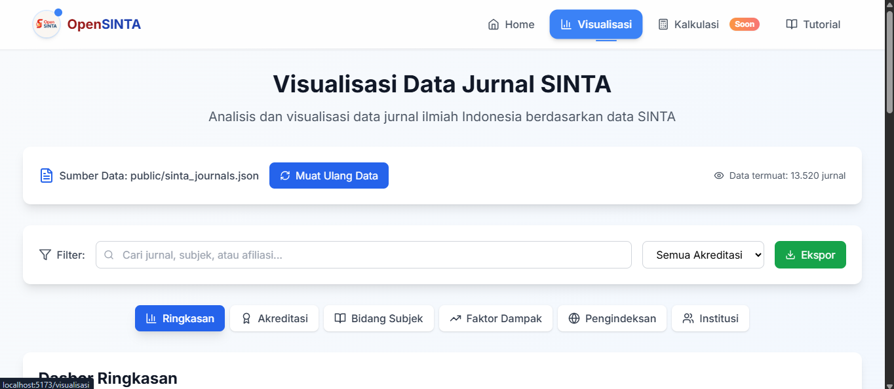
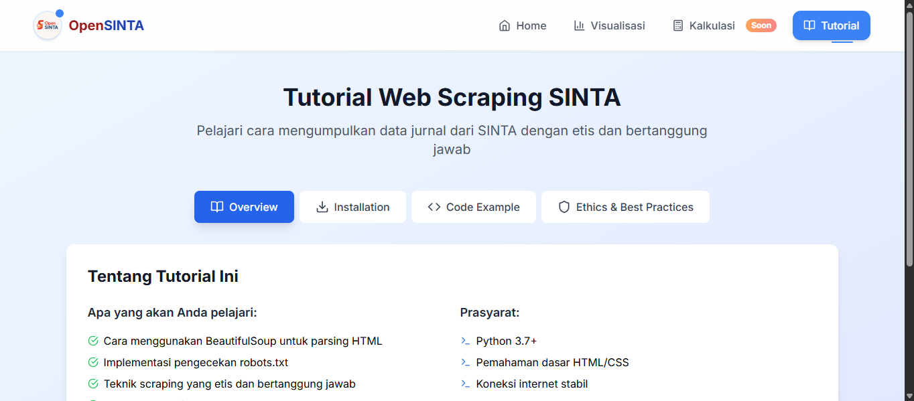

# OpenSINTA

<div align="center">
  
  
  [](https://github.com/firdausmntp/opensinta)
  [](LICENSE)
  [](https://reactjs.org/)
  [](https://vitejs.dev/)
  [](https://tailwindcss.com/)

**Platform visualisasi terbuka untuk data publikasi SINTA (Science and Technology Index) Indonesia**

[🌐 Live Demo](https://firdausmntp.github.io/opensinta/) | [📖 Documentation](#dokumentasi) | [🐛 Report Bug](https://github.com/firdausmntp/opensinta/issues)

</div>

---

## 📋 Daftar Isi

- [Tentang OpenSINTA](#tentang-opensinta)
- [Fitur Utama](#fitur-utama)
- [Teknologi](#teknologi)
- [Instalasi](#instalasi)
- [Penggunaan](#penggunaan)
- [Struktur Project](#struktur-project)
- [Komponen](#komponen)
- [Data Sources](#data-sources)
- [Kontribusi](#kontribusi)
- [Roadmap](#roadmap)
- [License](#license)

---

## 🎯 Tentang OpenSINTA

OpenSINTA adalah platform visualisasi data terbuka yang menyediakan analisis mendalam terhadap jurnal akademik Indonesia berdasarkan data SINTA (Science and Technology Index). Platform ini memungkinkan pengguna untuk mengeksplorasi, menganalisis, dan memvisualisasikan data publikasi akademik dengan interface yang modern dan responsif.

### 🎨 Preview

| Home Page                             | Visualisasi                                   | Tutorial                                      |
| ------------------------------------- | --------------------------------------------- | --------------------------------------------- |
|  |  |  |

---

## ✨ Fitur Utama

### 🏠 **Dashboard Utama**

- **Hero Section** dengan search bar terintegrasi
- **Quick Stats** dengan statistik real-time
- **Trending Topics** berdasarkan Subject Area dari data actual
- **Kategori Populer** dengan distribusi persentase
- **Journal Cards** dengan informasi lengkap dan aksi interaktif

### 📊 **Visualisasi Data**

- **Multiple Chart Types**: Bar Chart, Pie Chart, Scatter Plot
- **Interactive Filters**: Pencarian, Akreditasi, Subject Area
- **Data Export**: JSON dan CSV
- **Real-time Analytics**:
  - Distribusi Akreditasi SINTA (S1-S6)
  - Status Pengindeksan Scopus & Garuda
  - Analisis Impact Factor
  - Top Institutions
  - Subject Area Distribution

### 🎓 **Tutorial & Panduan**

- **Ethical Web Scraping** guidelines
- **Step-by-step** tutorial untuk scraping SINTA
- **Code Examples** dengan best practices
- **Error Handling** dan troubleshooting

### 🧮 **Kalkulator Tools** (Coming Soon)

- Impact Factor Predictor
- Citation Calculator
- Journal Ranking Tool
- Research Performance Analyzer

---

## 🛠️ Teknologi

### **Frontend Framework**

- **React 18.2.0** - Modern React dengan Hooks
- **React Router DOM 6.22.3** - Client-side routing
- **Vite 5.2.10** - Fast build tool dan development server

### **Styling & UI**

- **Tailwind CSS 3.4.3** - Utility-first CSS framework
- **Framer Motion 11.0.24** - Animation library
- **Lucide React 0.379.0** - Beautiful icons

### **Data Visualization**

- **Recharts 2.8.0** - Chart library untuk React
- **Custom Analytics** - Real-time data processing

### **Development Tools**

- **ESLint** - Code linting
- **PostCSS** - CSS processing
- **Autoprefixer** - CSS vendor prefixes

---

## 🚀 Instalasi

### Prasyarat

- **Node.js** >= 18.0.0
- **npm** >= 9.0.0
- **Git**

### Clone Repository

```bash
git clone https://github.com/firdausmntp/opensinta.git
cd opensinta
```

### Install Dependencies

```bash
npm install
```

### Development Server

```bash
npm run dev
```

Aplikasi akan berjalan di `http://localhost:5173`

### Build Production

```bash
npm run build
npm run preview
```

### Deploy ke GitHub Pages

```bash
npm run deploy
```

---

## 📱 Penggunaan

### 1. **Eksplorasi Data Jurnal**

- Buka halaman utama untuk melihat overview jurnal
- Gunakan search bar untuk mencari jurnal spesifik
- Filter berdasarkan Scopus, SINTA, atau Garuda indexing
- Klik jurnal untuk melihat detail dan aksi:
  - **Kunjungi Website** - Buka website jurnal
  - **Profil SINTA** - Lihat profil di portal SINTA
  - **Bagikan** - Share jurnal via native sharing atau clipboard

### 2. **Analisis & Visualisasi**

```bash
# Navigate ke halaman Visualisasi
/visualisasi
```

- **Overview Dashboard** - Statistik umum
- **Chart Navigation** - Pilih jenis analisis:
  - Akreditasi SINTA
  - Bidang Subjek
  - Impact Factor
  - Status Pengindeksan
  - Top Institutions
- **Filters** - Gunakan search dan filter akreditasi
- **Export Data** - Download hasil analisis

### 3. **Tutorial Scraping**

```bash
# Navigate ke halaman Tutorial
/tutorial
```

- **Overview** - Pengenalan web scraping
- **Installation** - Setup environment
- **Code Examples** - Implementasi scraper
- **Ethics** - Guidelines untuk scraping yang bertanggung jawab

### 4. **Kalkulator Tools**

```bash
# Navigate ke halaman Kalkulator
/kalkulasi
```

- **Subscribe** untuk notifikasi launch
- **Preview** fitur yang akan datang

---

## 📁 Struktur Project

```
opensinta/
├── public/                     # Static assets
│   ├── opensinta.png          # Logo aplikasi
│   ├── sinta_journals.json    # Main dataset
│   ├── sinta1.json           # S1 accredited journals
│   ├── sinta2.json           # S2 accredited journals
│   ├── sinta3.json           # S3 accredited journals
│   ├── sinta4.json           # S4 accredited journals
│   ├── sinta5.json           # S5 accredited journals
│   └── sinta6.json           # S6 accredited journals
├── src/
│   ├── components/            # React components
│   │   ├── Home.jsx          # Main dashboard
│   │   ├── Visualisasi.jsx   # Data visualization
│   │   ├── Tutorial.jsx      # Scraping tutorial
│   │   ├── Kalkulasi.jsx     # Calculator tools
│   │   ├── Navbar.jsx        # Navigation component
│   │   └── Footer.jsx        # Footer component
│   ├── App.jsx               # Main app component
│   ├── main.jsx             # Entry point
│   └── index.css            # Global styles
├── index.html               # HTML template
├── package.json            # Dependencies & scripts
├── vite.config.js         # Vite configuration
├── tailwind.config.js     # Tailwind CSS config
├── postcss.config.js      # PostCSS config
└── README.md              # Documentation
```

---

## 🧩 Komponen

### **Home.jsx** - Dashboard Utama

```jsx
// Core components
├── HeroSection          # Search & filters
├── QuickStats          # Real-time statistics
├── JournalList         # Featured journals with pagination
├── JournalCard         # Individual journal display
├── Pagination          # Page navigation
└── Sidebar             # Trending topics & categories
```

**Key Features:**

- **Real-time Subject Analysis** dari JSON data
- **Interactive Search** dengan multiple filters
- **Dynamic Trending Topics** berdasarkan Subject Area
- **Kategori Populer** dengan distribusi actual

### **Visualisasi.jsx** - Data Analytics

```jsx
// Chart components
├── Overview Dashboard   # Summary statistics
├── Accreditation Chart # SINTA level distribution
├── Subject Analysis    # Subject area breakdown
├── Impact Scatter      # Impact factor analysis
├── Indexing Status     # Scopus/Garuda indexing
├── Institution Ranking # Top institutions
└── Data Table         # Paginated data view
```

**Key Features:**

- **Multiple Chart Types**: Bar, Pie, Scatter, Line
- **Interactive Filters**: Real-time data filtering
- **Export Functionality**: JSON/CSV download
- **Responsive Design**: Mobile-friendly charts

### **Tutorial.jsx** - Learning Platform

```jsx
// Tutorial sections
├── Overview            # Introduction to scraping
├── Installation       # Environment setup
├── Code Examples      # Practical implementation
└── Ethics             # Responsible scraping
```

**Key Features:**

- **Copy-to-clipboard** code examples
- **Step-by-step** guides
- **Best practices** untuk ethical scraping
- **Error handling** strategies

### **Kalkulasi.jsx** - Future Tools

```jsx
// Calculator features (planned)
├── Impact Predictor    # Predict journal impact
├── Citation Calculator # Citation analysis
├── Ranking Tool       # Journal evaluation
└── Performance Analyzer # Research metrics
```

---

## 📊 Data Sources

### **Structure Dataset**

```json
{
  "Nama Jurnal": "string",
  "Profile URL": "string",
  "Google Scholar URL": "string",
  "Website URL": "string",
  "Editor URL": "string",
  "P-ISSN": "string",
  "E-ISSN": "string",
  "Subject Area": "string",
  "Afiliasi": "string",
  "Akreditasi Sinta": "string",
  "Scopus Indexed": "Yes/No",
  "Garuda Indexed": "Yes/No",
  "Impact": "number",
  "H5-index": "number",
  "Citations 5yr": "string",
  "Citations": "string"
}
```

### **Data Processing**

- **Validation**: `isValidValue()` dan `getDisplayValue()` helpers
- **Filtering**: Multi-criteria filtering system
- **Sorting**: Impact factor, name, SINTA level
- **Analytics**: Real-time statistics calculation
- **Export**: JSON dan CSV format

---

## 🤝 Kontribusi

Kontribusi sangat diterima! Silakan ikuti langkah berikut:

### 1. **Fork Repository**

```bash
# Fork via GitHub UI atau
gh repo fork firdausmntp/opensinta
```

### 2. **Create Feature Branch**

```bash
git checkout -b feature/amazing-feature
```

### 3. **Commit Changes**

```bash
git commit -m "feat: add amazing feature"
```

### 4. **Push & Pull Request**

```bash
git push origin feature/amazing-feature
# Create PR via GitHub UI
```

### **Contribution Guidelines**

- Follow existing code style
- Add proper documentation
- Include tests if applicable
- Update README if needed

---

## 🗺️ Roadmap

### **Phase 1: Foundation** ✅

- [x] Basic dashboard dan visualization
- [x] Data processing dan filtering
- [x] Responsive design
- [x] Tutorial section

### **Phase 2: Calculator Tools** 📋

- [ ] Impact Factor Predictor
- [ ] Citation Calculator
- [ ] Journal Ranking Tool
- [ ] Research Performance Analyzer

---

## 📄 License

Distributed under the MIT License. See `LICENSE` for more information.

---

## 🙏 Acknowledgments

- **SINTA (Science and Technology Index)** untuk data publikasi
- **Kemenristekdikti** untuk platform SINTA
- **Open Source Community** untuk tools dan libraries
- **Contributors** yang telah berkontribusi

---

## 📞 Contact

**Firdausmntp**

- Website: [firdausmntp.github.io](https://firdausmntp.github.io)
- GitHub: [@firdausmntp](https://github.com/firdausmntp)

**Project Link**: [https://github.com/firdausmntp/opensinta](https://github.com/firdausmntp/opensinta)

---

<div align="center">
  <sub>Built with ❤️ by <a href="https://github.com/firdausmntp">firdausmntp</a></sub>
</div>
